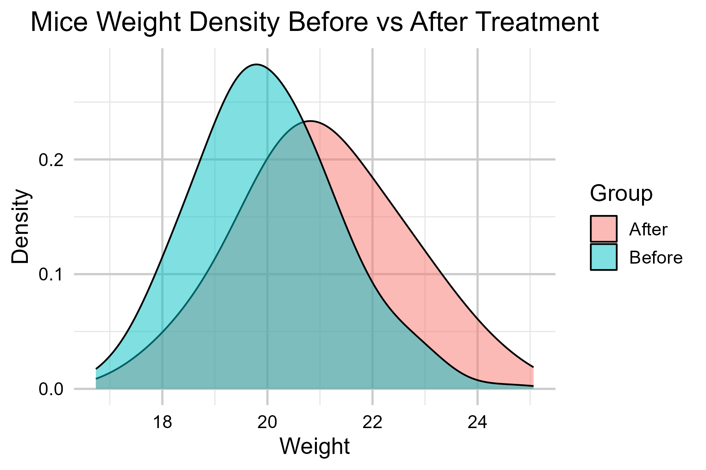
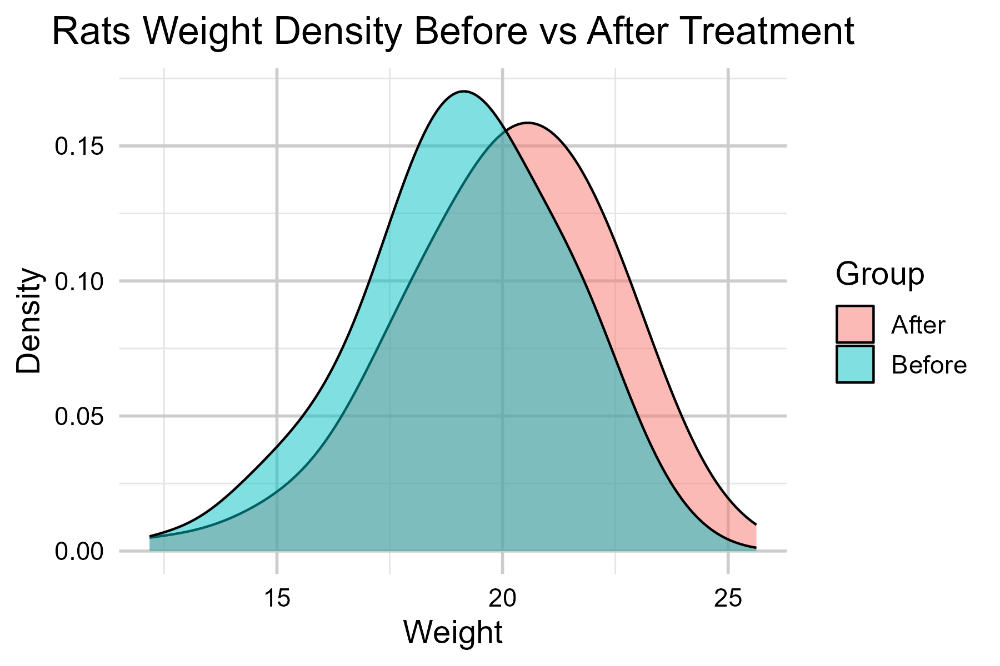
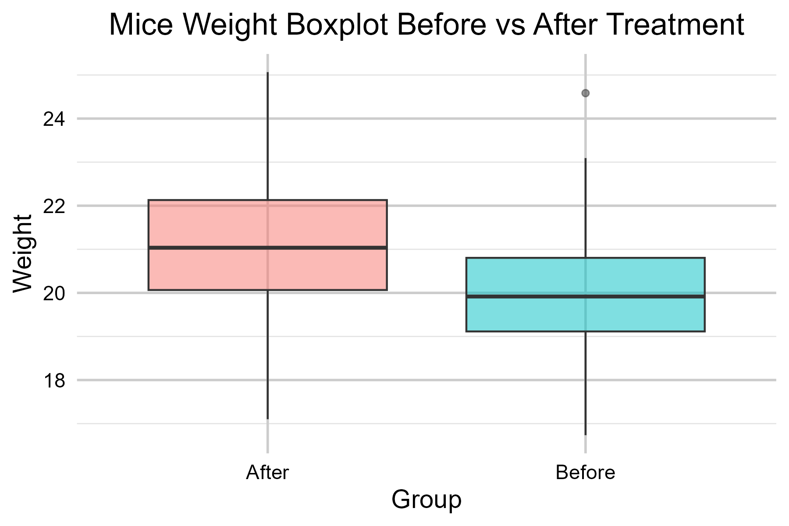
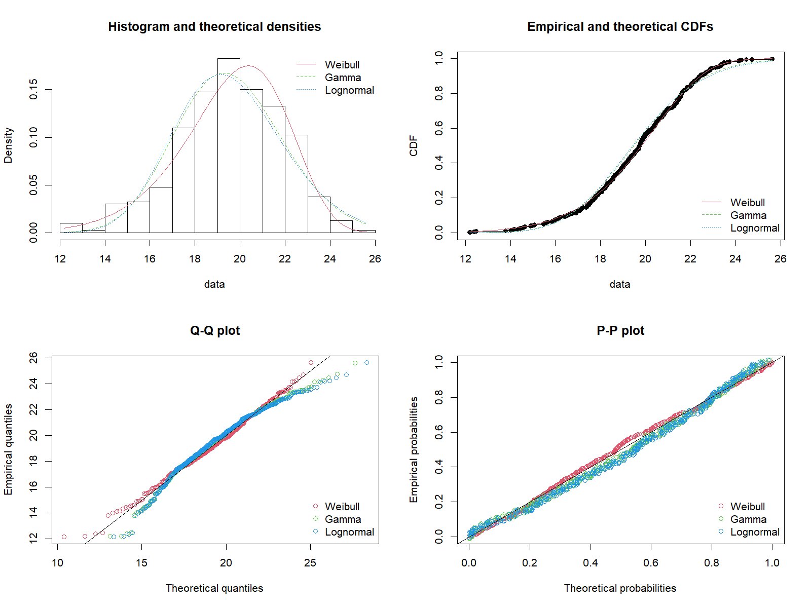

# Statistical Hypothesis Testing in R: Treatment Effects on Simulated Data

**Exploring Data Generation, Visualisation, and Statistical Testing in R**.

<br>

## 📖 Overview

This project demonstrates how to perform statistical hypothesis testing and distribution fitting in R using simulated experimental datasets.  
It focuses on:

- Generating synthetic datasets for two populations (mice and rats) with treatment effects.  
- Visualising data distributions using density plots and boxplots.  
- Checking normality assumptions with QQ plots and Shapiro-Wilk tests.  
- Performing paired t-tests and non-parametric tests to evaluate treatment effects.  
- Fitting and comparing multiple statistical distributions (Weibull, Lognormal, Gamma) to data.  

The project serves as a hands-on example for researchers, students, or data enthusiasts interested in understanding statistical testing workflows in R.

<br>

## 📊 Results

**Density Plots**  
_Compare the "before" and "after" treatment distributions for mice and rats_  

<div style="display: flex; align-items: flex-start;">
  
  
</div>

<br>

**Boxplots**  
_Visual summary of weight changes due to treatment_

<div style="display: flex; align-items: flex-start;">
  
  
</div>

<br>

**Distribution Fitting**  
_Comparison of fitted Weibull, Lognormal, and Gamma distributions for rats_



<br>

## ⚙️ Installation & Usage

1. Ensure you have **R** installed (version 4.0+ recommended) and install the required packages:

```R
install.packages(c("tidyverse", "fitdistrplus", "ggplot2"))
```
2. Clone this repository:
```
git clone https://github.com/YOUR_USERNAME/statistical-hypothesis-r.git
cd statistical-hypothesis-r
```
3. Run the R script:
```
source("statistical_hypothesis_testing.R")
```
4. Experiment!

<br>

## 🤝 Contribution
Contributions, suggestions, and improvements are welcome! Feel free to open an issue or submit a pull request.

<br>

## 🧑‍💻 Author
[Arslonbek Ishanov](https://github.com/Arslan2003) - First-Class Data Science Graduate & AI/ML Enthusiast.

<br>

## ⚖️ License
This project is licensed under the MIT License - see the [LICENSE](LICENSE) file for details.

<br>

## 🔗 Learn More
Read the detailed report explaining the underlying theory, methodology, and results [here](Statistical_Hypothesis_Testing-Report.pdf).
